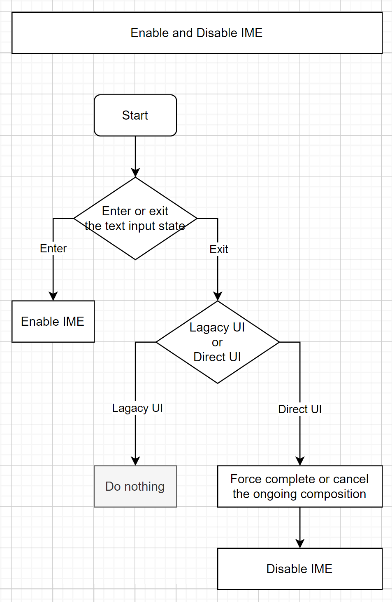
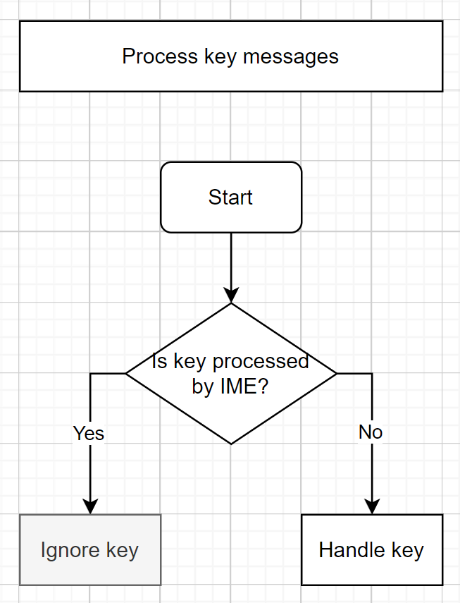
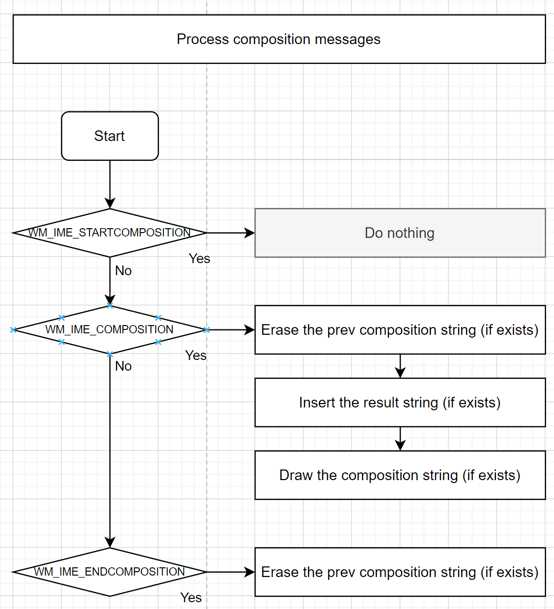
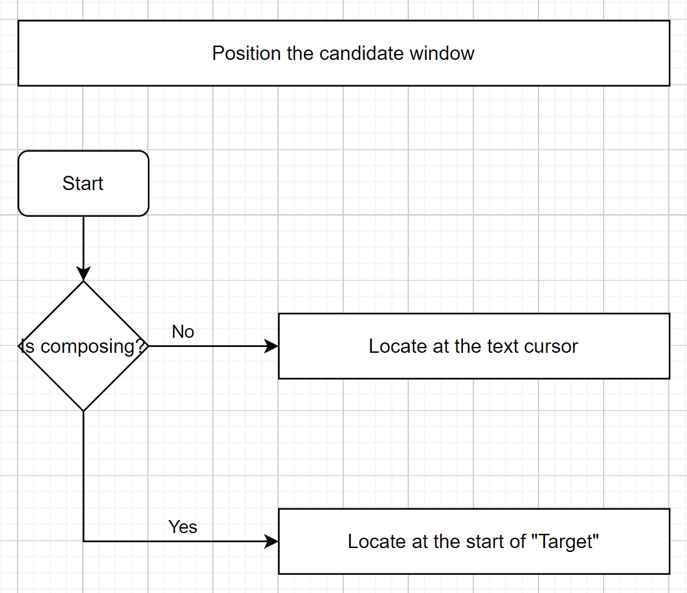

# Windows IME-aware Application Design Guide

This is not an official document from Microsoft, but a guide I have compiled based on practice. If there are any errors, please feel free to correct them.

The official document from Microsoft is here:
https://learn.microsoft.com/en-us/windows/win32/intl/input-method-manager

Note: The Windows's built-in "notepad" is based on TSF, while this example is based on IMM. The same IME performs slightly differently in TSF based and IMM based programs.

Tip: You can view the composition message records of various IMEs in the **docs/ime-messages-log/** directory.

Outline:

1. [Enable and Disable IME](#1-enable-and-disable-ime)

2. [Process key messages](#2-process-key-messages)

3. [Process composition messages](#3-process-composition-messages)

4. [Position the candidate window](#4-position-the-candidate-window)

5. [Overview of some IMEs behavior](#5-overview-of-some-imes-behavior)

## 1. Enable and Disable IME



Guide:

- Enable IME when users need to input text.

- Disable IME when users does not need to input text.

The most common scenario is that when the user activates the text box, the program enables the IME, and when the user leaves the text box, the program disables the IME.

For programs that are not primarily focused on text editing, they often use text input related keys as shortcut keys, such as the "V" key in Photoshop to switch to the Move tool. If the IME is enabled in the window, when the user presses the "V" key, the IME is likely to intercept the key and enter the composition process, making it impossible for the user to use the program's shortcut keys normally. Therefore, when users are in a scenario where they do not need to input text, the program should actively disable the IME to avoid it interfering with the user.

On the contrary, if the user needs to input text, the program should actively enable the IME, otherwise the user cannot input text through the IME.

The IME can be enabled for the current window through the following code:

```
ImmAssociateContextEx(hWnd, NULL, IACE_DEFAULT);
```

The IME can be disabled for the current window through the following code:

```
ImmAssociateContextEx(m_hwnd, NULL, 0);
```

`ImmAssociateContextEx` only affects the specified window and does not affect other windows or programs.

If you are using Direct UI (a top-level window containing multiple controls that share the same window), you need to force complete or cancel composition when the text box loses focus, and disable the IME:

```
HIMC hImc = ImmGetContext(hWnd);
if (hImc) {
    ImmNotifyIME(hImc, NI_COMPOSITIONSTR, CPS_COMPLETE, 0); // or CPS_CANCEL
    ImmReleaseContext(hWnd, hImc);
}

ImmAssociateContextEx(m_hwnd, NULL, 0);
```

If you are using Lagacy UI (a top-level window containing multiple controls, each with its own window), no action is required. Because IMM will automatically force complete composition when the control window loses focus. The enable/disable state of the IME is determined by the new focus window, and the old focus window has no effect on that.

Related source code:
- `TextEditor::OnSetFocus()`
- `TextEditor::OnKillFocus()`

## 2. Process key messages



Guide:

- The program only needs to handle the keys that the IME does not handle.

When the program receives messages of `WM_KEYDOWN`, `WM_KEYUP`, `WM_SYSKEYDOWN`, and `WM_SYSKEYUP`, if `wParam` is `VK_PROCESSKEY`, it means that the key is processed by IME and the program should not process it.

The keys processed by IME will eventually be converted into IME composition messages and sent to the window.

Related source code:
- `TextEditor::OnKeyDown()`

## 3. Process composition messages

Microsoft's description of composition strings: https://learn.microsoft.com/zh-cn/windows/win32/intl/composition-string

View with the content in the **docs/ime-messages-log/** directory maybe better understanding the content in Microsoft documentation.

For a deeper understanding of "Attribute" and "Clause", you can refer to `japanese_ime_microsoft_2.txt` and `chinese_ime_microsoft_pinyin_2.txt`.



Guide:

- When receiving the `WM_IME_STARTCOMPOSITION` message:

    - Generally, nothing need to do.

- When receiving the `WM_IME_COMPOSITION` message:

    - Erase the prev composition string (if exists).

    - If the result string (`GCS_RESULTSTR`) exists, insert that into the text being edited.

    - If the composition string (`GCS_COMPSTR`) exists, draw it in the UI.

        When drawing composition string, special styles need to be added so that users can distinguish the scope of the composition string.

        The special style of each character is determined by the composition string attribute (`GCS_COMPATTR`).

        - Dotted: for `ATTR_INPUT`

        - Thick underline: for `ATTR_TARGET_CONVERTED`, `ATTR_TARGET_NOTCONVERTED`

        - Thin underline: for `ATTR_CONVERTED`, `ATTR_INPUT_ERROR`, `ATTR_FIXEDCONVERTED`

        If `GCS_COMPATTR` does not exist, there is no need to draw a special style.

        Related source code: `TextEditor::Render()` 

- When receiving the `WM_IME_ENDCOMPOSITION` message:

    - Erase the prev composition string (if exists).

    Regardless of whether the composition is completed or cancelled, the IME will send a `WM_IME_ENDCOMPOSITION` message.

Related source code:
- `TextEditor::OnIMECompositionStart()`
- `TextEditor::OnIMEComposition()`
- `TextEditor::OnIMECompositionEnd()`

## 4. Position the candidate window



Guide:

- When will the candidate window positions be updated?

    - As long as the position of the cursor on the screen changes, the program needs to actively update the position of the candidate window.

    - Do not rely on `IMN_OPENCANDIDATE` to update candidate window, as some IMEs do not generate this notification.

    - Do not update candidate window in `IMN_SETCANDIDATEPOS`, otherwise it will cause infinite loops.

    - Can respond to `IMR_QUERYCHARPOSITION`, but based on practical results, it is not necessary.

- How to set candidate window positions?

    - Call the `ImmSetCandidateWindow` function.

        - When using `CFS_CANDIDATEPOS`, `ptCurrentPos` refers to the upper left corner of the candidate window.

        - When using `CFS_EXCLUDE`, `ptCurrentPos` refers to the upper left corner of text cursor. To avoid candidate window covering composition string, `rcArea` needs to exclude at least the area occupied by the text cursor. If possible, the program should try to use `CFS_EXCLUDE` instead of `CFS_CANDIDATEPOS`. In general, IME will attempt to align the upper left corner of the candidate window to the desired position of the program, but if it does not work, IME will automatically adjust the position of the candidate window.

        - It is necessary to simultaneously set the position of the system cursor, as some IMEs only locate candidate windows based on the system cursor.

    - When there is not an ongoing composition, the program should position the candidate window at the text cursor.

    - When there is an ongoing composition, it is recommended that the program locate the candidate window at the beginning of the target. Calculation method of target:

        - If there is an `ATTR_TARGET_CONVERTED` or `ATTR_TARGET_NOTCONVERTED` attribute, the character range of that attribute is used as the target.

        - Otherwise, If `GCS_COMPCLAUSE` exists, use the clause that includes `GCS_CURSORPOS` as the target.

        - Otherwise, use the entire composition string as the target.

        The last two rules are additional and are used to deal with IME that do not generate the ATTR_TARGET_XXX attribute.

        It is not recommended to locate the candidate window at the end of the composition string, as this will cause the candidate window to constantly move along with the changes in the composition string, affecting the user's observation of the content of the candidate window.

Related source code:
- `TextEditor::UpdateCandidateWindowPos()`

## 5. Overview of some IMEs behavior

- The candidate windows for some IMEs are only located based on the position of the system cursor, ignoring the `ImmSetCandidateWindow` request.

    Therefore, when setting the position of the candidate window through `ImmSetCandidateWindow`, it is necessary to also set the position of the system cursor.

    Please refer to the `TextEditor::UpdateCandidateWindowPos()` function in this example.

- The old version of Microsoft Korean IME (i.e. compatibility mode) produces atypical synthesized message sequence.

    The composition message generated by this IME has a defect, as it will send a `WM_IME_COMPOSITION` message outside of the range of `WM_IME_STARTCOMPOSITION` to `WM_IME_ENDCOMPOSITION`.

    Please refer to the message record in [docs/ime-message-log/korean_ime_microsoft(compatibility_mode).txt](../ime-messages-log/korean_ime_microsoft(compatibility_mode).txt) for details.

    If the program needs to support this IME, the best approach is to ensure that the processing logic of the `WM_IME_COMPOSITION` message does not depend on the `WM_IME_STARTCOMPOSITION` and `WM_IME_ENDCOMPOSITION` messages, that is, do not assume that the `WM_IME_COMPOSITION` message will always appear between the '`WM_IME_STARTCOMPOSITION` and `WM_IME_ENDCOMPOSITION` messages.

    Please refer to the `TextEditor::OnIMEComposition()` function in this example.

- The new version of Microsoft Korean IME will send a very compact composite message sequence.

    Please refer to the message record in [docs/ime-message-log/korean_ime_microsoft.txt](../ime-messages-log/korean_ime_microsoft.txt) for details.

    The internal logic of each program is complex, and this compact message sequence may cause problems in your program. During testing, additional testing of the program's support for the new version of Microsoft Korean IME is required.

- Most third-party Chinese IMEs will draw the composition string into their own candidate window (regardless of whether the program is willing to draw the composition string or not), and send the program an empty composition string (completely empty or with only one space).

    This design allows the IME to provide users with rich prompts around composition string, such as spelling order errors and their correction suggestions.

    If all input methods use this design, perhaps the program wouldn't have to do so much work around composition string.
