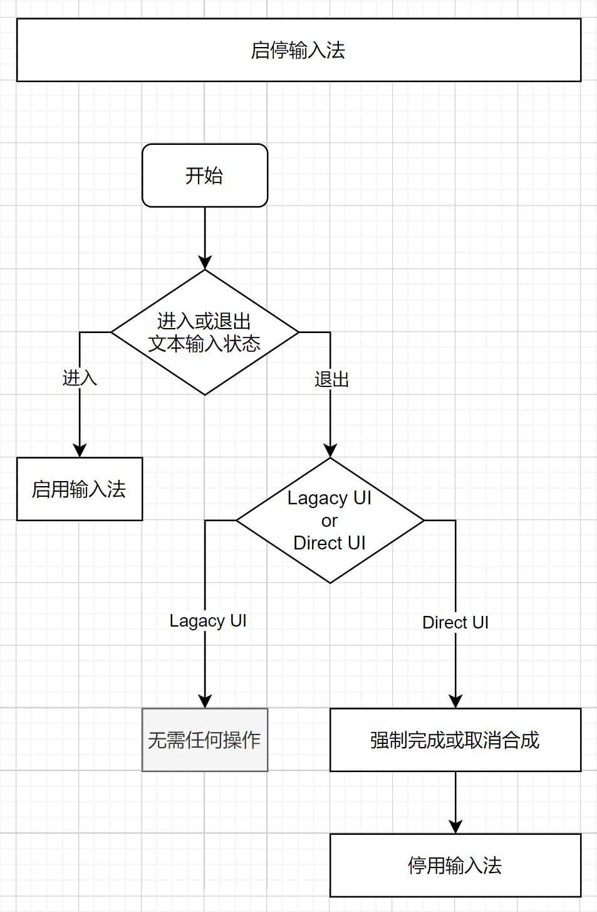
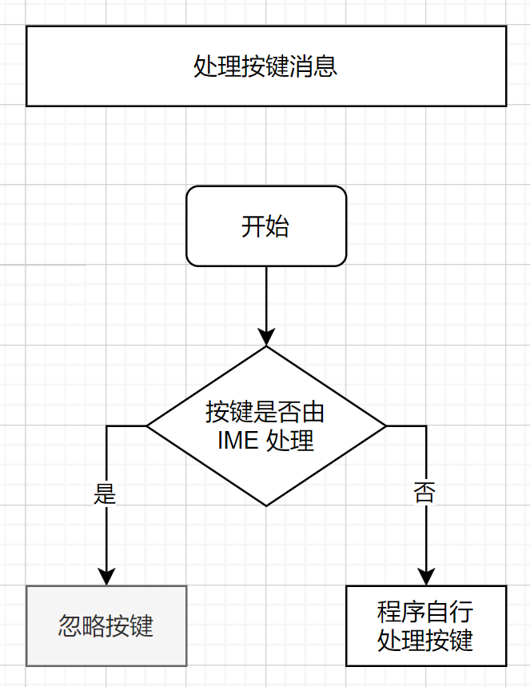
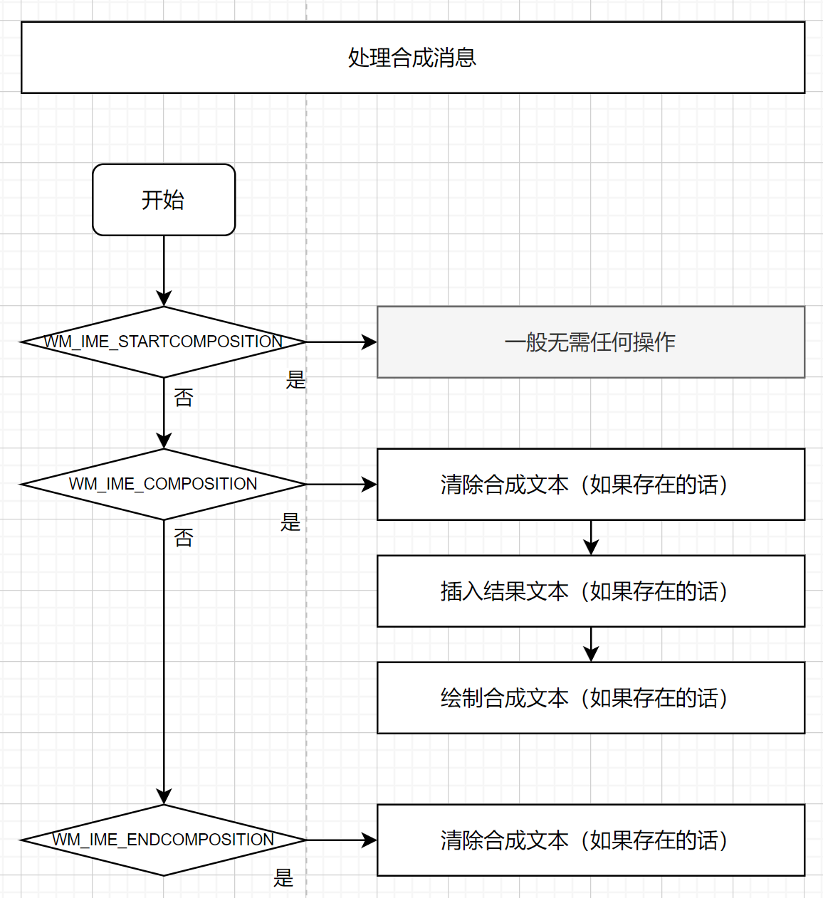
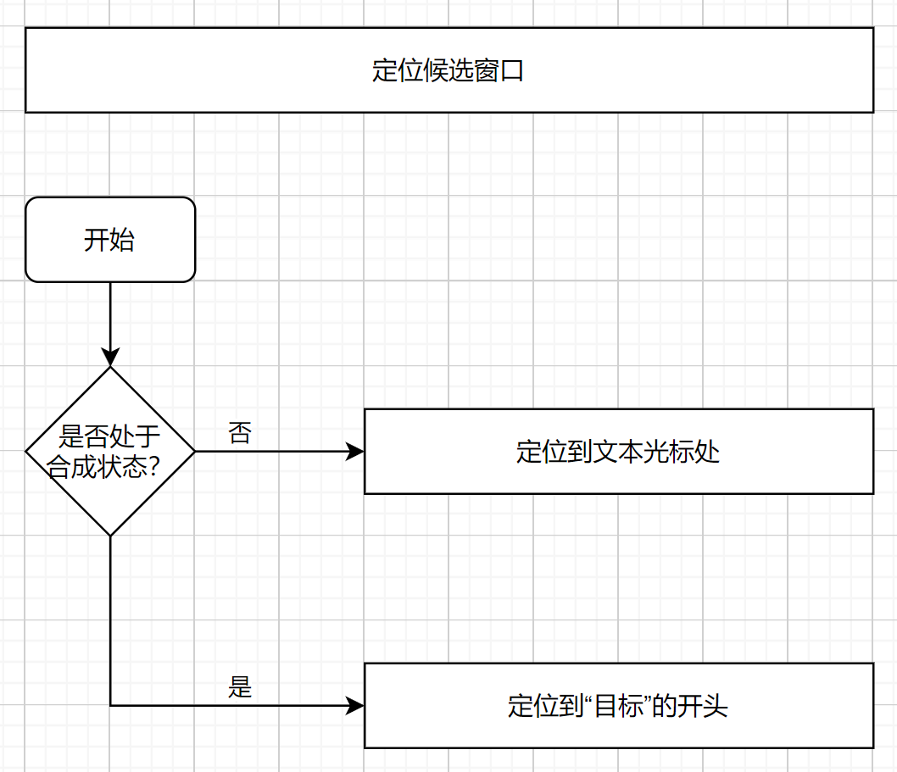

# Windows IME-aware 程序设计指南

这不是微软官方的文档，只是我根据实践整理出来的指南，如有错误欢迎指正。

微软的官方文档在这里：
https://learn.microsoft.com/en-us/windows/win32/intl/input-method-manager

注意：微软系统自带的记事本程序是基于 TSF 的程序，而本示例是基于 IMM 的。同一个输入法在基于 TSF 和基于 IMM 的程序中表现的行为略有差异。

提示：在 **docs/ime-messages-log/** 目录中可以查看各种输入法的合成消息记录。

大纲：

1. [启停输入法](#1-启停输入法)

2. [处理按键消息](#2-处理按键消息)

3. [处理合成消息](#3-处理合成消息)

4. [定位候选窗口](#4-定位候选窗口)

5. [输入法行为一览](#5-输入法行为一览)

## 1. 启停输入法



指南：

- 当用户需要输入文字的时候，启用输入法；

- 当用户无需输入文字的时候，停用输入法。

最常见的场景是，用户激活文本框时，程序启用输入法，用户离开文本框时，程序停用输入法。

对于不以文本编辑为主的程序，程序往往会将文本输入相关的按键作为快捷键，譬如 Photoshop 中可以通过 “V” 键切换到移动工具。如果窗口启用了输入法，则用户按下 “V” 键时，输入法很可能会拦截该按键并进入合成流程，使得用户无法正常使用程序的快捷键。因此当用户处于无需输入文本的场景时，程序应该主动停用输入法，避免输入法干扰用户。

相反，如果用户需要输入文本，则程序应该主动启用输入法，否者用户无法通过输入法输入文字。

通过以下代码可以为当前窗口启用输入法：

```
ImmAssociateContextEx(hWnd, NULL, IACE_DEFAULT);
```

通过以下代码可以为当前窗口停用输入法：

```
ImmAssociateContextEx(m_hwnd, NULL, 0);
```

`ImmAssociateContextEx` 仅影响指定的窗口，不影响其它窗口，也不影响其它程序。

如果你使用的是 Direct UI（一个顶层窗口包含多个控件，所有控件共享同一个窗口），则需要在输入框失去焦点的时候，强制完成或取消合成，并且停用输入法：

```
HIMC hImc = ImmGetContext(hWnd);
if (hImc) {
    ImmNotifyIME(hImc, NI_COMPOSITIONSTR, CPS_COMPLETE, 0); // or CPS_CANCEL
    ImmReleaseContext(hWnd, hImc);
}

ImmAssociateContextEx(m_hwnd, NULL, 0);
```

如果你使用的是 Lagacy UI（一个顶层窗口包含多个控件，每个控件拥有自己的窗口），则无需进行任何操作。因为 IMM 会在控件窗口失去焦点后，自动强制完成合成。而输入法的启停状态由新的焦点窗口决定，旧的焦点窗口对输入法的启停状态没有影响。

相关源码：
- `TextEditor::OnSetFocus()`
- `TextEditor::OnKillFocus()`

## 2. 处理按键消息



指南：

- 程序只需要处理 IME 不处理的按键。

程序在收到 WM_KEYDOWN、WM_KEYUP、WM_SYSKEYDOWN、WM_SYSKEYUP 消息时，如果 wParam 为 VK_PROCESSKEY，则表示该按键由 IME 处理，程序不应该处理。

被 IME 处理的按键最终会转为 IME 合成消息发送到窗口。

相关源码：
- `TextEditor::OnKeyDown()`

## 3. 处理合成消息

微软关于合成字符串的描述：https://learn.microsoft.com/zh-cn/windows/win32/intl/composition-string

结合 **docs/ime-messages-log/** 目录中的内容或者可以更好理解微软文档中的内容。

关于“属性”和“子句”，可以通过查看 japanese_ime_microsoft.txt 和 chinese_ime_microsoft_pinyin.txt 获得更深入的了解。



指南：

- 收到 `WM_IME_STARTCOMPOSITION` 消息时：

    - 一般无需进行任何操作。

- 收到 `WM_IME_COMPOSITION` 消息时：

    - 删除界面中的合成文本（如果存在的话）。

    - 如果包含结果文本（`GCS_RESULTSTR`），则将结果文本插入正在编辑的文本中。

    - 如果包含合成文本（`GCS_COMPSTR`），将合成文本以临时的形式绘制在界面中。

        绘制合成文本时，需要添加特殊样式以便让用户可以区分出合成文本的范围。

        每个字符的特殊样式根据合成文本属性（`GCS_COMPATTR`）来决定。

        - 点状线用于：`ATTR_INPUT`

        - 厚下划线用于：`ATTR_TARGET_CONVERTED`、`ATTR_TARGET_NOTCONVERTED`

        - 薄下划线用于：`ATTR_CONVERTED`、`ATTR_INPUT_ERROR`、`ATTR_FIXEDCONVERTED`

        如果 `GCS_COMPATTR` 不存在，则不绘制特殊样式。

        相关源码：`TextEditor::Render()` 

- 收到 `WM_IME_ENDCOMPOSITION` 消息时：

    - 删除界面中的合成文本（如果存在的话）。

    无论完成或取消合成，输入法都会发送 `WM_IME_ENDCOMPOSITION` 消息。

相关源码：
- `TextEditor::OnIMECompositionStart()`
- `TextEditor::OnIMEComposition()`
- `TextEditor::OnIMECompositionEnd()`

## 4. 定位候选窗口



指南：

- 何时更新候选窗口位置？

    - 只要光标在屏幕中的位置发生改变，程序就需要主动更新候选窗口的位置。

    - 不要依赖 `IMN_OPENCANDIDATE` 来更新候选窗口，因为某些输入法不产生这个通知。

    - 不要在 `IMN_SETCANDIDATEPOS` 中更新候选窗口，否者会导致无限循环。

    - 可以响应 `IMR_QUERYCHARPOSITION`，但就测试的结果来看，不是必要的。

    - 不要在 `IMR_QUERYCHARPOSITION` 中更新候选窗口，否者会导致无限循环。

- 如何设置候选窗口位置？

    - 调用 `ImmSetCandidateWindow` 函数。

        - 使用 `CFS_CANDIDATEPOS` 时，`ptCurrentPos` 指候选窗口左上角对齐的位置。

        - 使用 `CFS_EXCLUDE` 时，`ptCurrentPos` 指程序的文本光标左上角的位置。为了避免候选窗口遮挡合成文本，`rcArea` 至少需要排除文本光标所占的区域。如果可以，程序应该尽量使用 `CFS_EXCLUDE` 而不是 `CFS_CANDIDATEPOS`。一般情况下输入法会尝试将候选窗口的左上角对齐到程序其望的位置，但是如果不行，输入法会自动调整候选窗口的位置。

        - 需要同时设置系统光标的位置，因为某些输入法只根据系统光标来定位候选窗口。

    - 处于非合成时，程序应该将候选窗口定位到程序的文本光标处。

    - 处于合成时，建议程序将候选窗口定位到目标的开头。目标的计算方法：

        - 如果存在 `ATTR_TARGET_CONVERTED` 或 `ATTR_TARGET_NOTCONVERTED` 属性，则将该属性的字符范围作为目标。

        - 否则，如果子句（`GCS_COMPCLAUSE`），则将光标（`GCS_CURSORPOS`）所在的子句作为目标。

        - 否则将整个合成文本作为目标。

        后两个规则是额外添加的，用于应对不产生 ATTR_TARGET_XXX 属性的输入法。

        不建议将候选窗口定位到合成文本末尾，这样会导致候选窗口跟随合成文本变化而不断移动，影响用户观察候选窗口的内容。

相关源码：
- `TextEditor::UpdateCandidateWindowPos()`

## 5. 输入法行为一览

- 某些输入法的候选窗口只根据系统光标的位置进行定位，无视 `ImmSetCandidateWindow` 请求。

    因此通过 `ImmSetCandidateWindow` 设置候选窗口的位置时，需要同时设置系统光标的位置。

    请参考示例中的 `TextEditor::UpdateCandidateWindowPos()` 函数。

- 旧版微软朝鲜语输入法（即兼容模式）会产生非典型合成消息序列。

    该输入法生成的合成消息存在缺陷，会在 `WM_IME_STARTCOMPOSITION` 到 `WM_IME_ENDCOMPOSITION` 之外发送 `WM_IME_COMPOSITION` 消息。

    详细请参考 [docs/ime-message-log/korean_ime_microsoft(compatibility_mode).txt](../ime-messages-log/korean_ime_microsoft(compatibility_mode).txt) 中的消息记录。

    如果程序需要支持该输入法，最好的方法是确保 `WM_IME_COMPOSITION` 消息的处理逻辑不依赖 `WM_IME_STARTCOMPOSITION` 和 `WM_IME_ENDCOMPOSITION` 消息，即不要假设 `WM_IME_COMPOSITION` 消息必定出现在 `WM_IME_STARTCOMPOSITION` 和 `WM_IME_ENDCOMPOSITION` 消息之间。

    请参考示例中的 `TextEditor::OnIMEComposition()` 函数。

- 新版微软朝鲜输入法会发送非常紧凑的合成消息序列。

    详细请参考 [docs/ime-message-log/korean_ime_microsoft.txt](../ime-messages-log/korean_ime_microsoft.txt) 中的消息记录。

    各个程序的内部逻辑是复杂的，这种紧凑的消息序列可能会在你的程序中产生问题，在测试时，需要额外测试程序对新版微软朝鲜输入法的支持度。

- 大部分第三方的中文输入法会将合成文本绘制到自己的候选窗口中（无论程序是否愿意绘制合成文本），并且向程序发送空的合成文本（完全空或者只有一个空格）。

    这样的设计使得输入法可以向用户提供非常丰富的围绕合成文本的提示信息，譬如拼写顺序错误，以及其纠正建议。

    如果所有输入法都使用这种设计，或许程序就不用围绕合成文本做那么多工作了。
