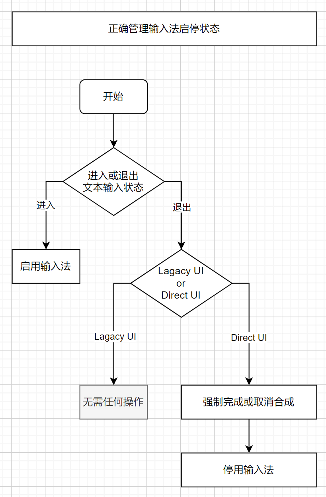
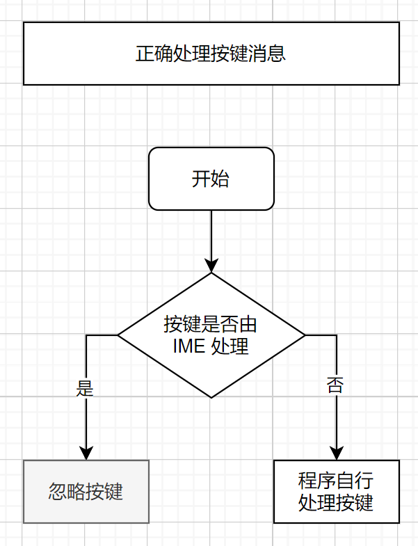
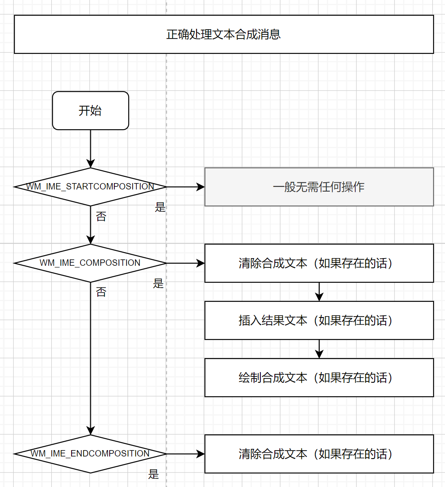
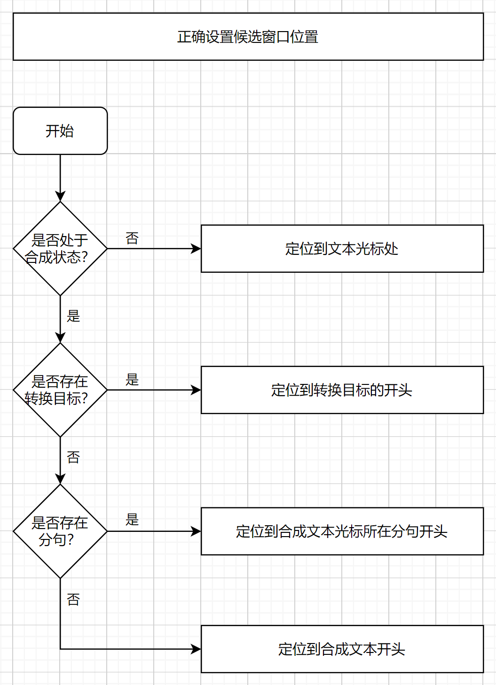

# Windows IME-aware 程序设计指南

大纲：

1. [启停输入法](#1-启停输入法)

2. [处理按键消息](#2-处理按键消息)

3. [处理合成消息](#3-处理合成消息)

4. [定位候选窗口](#4-定位候选窗口)

5. [特殊情况](#5-特殊情况)

提示：在 **docs/ime-messages-log/** 目录中可以查看各种输入法的合成消息记录。

## 1. 启停输入法



准则：

- 当用户需要输入文字的时候，启用输入法；

- 当用户无需输入文字的时候，停用输入法。

最常见的场景是，用户激活文本框时，程序启用输入法，用户离开文本框时，程序停用输入法。

对于不以文本编辑为主的程序，程序往往会将文本输入相关的按键作为快捷键，譬如 Photoshop 中可以通过 “V” 键切换到移动工具。如果窗口启用了输入法，则用户按下 “V” 键时，输入法会拦截该按键，使得用户无法正常使用程序的快捷键。因此当用户处于无需输入文本的场景时，程序应该主动停用输入法，避免输入法干扰用户。

相反，如果用户激活文本框（即用户需要输入文本），程序应该主动启用输入法，否者用户无法通过输入法输入文字。

通过以下代码可以为当前窗口启用输入法：

```
ImmAssociateContextEx(hWnd, NULL, IACE_DEFAULT);
```

通过以下代码可以为当前窗口停用输入法：

```
ImmAssociateContextEx(m_hwnd, NULL, 0);
```

ImmAssociateContextEx 函数仅设置输入法对指定的窗口是否有效，不影响其它窗口，也不影响其它程序。

如果你使用的是 Direct UI（一个顶层窗口包含多个控件，所有控件共享同一个窗口），则需要在输入框失去焦点的时候，强制完成或取消合成，并且停用输入法：

```
HIMC hImc = ImmGetContext(hWnd);
if (hImc) {
    ImmNotifyIME(hImc, NI_COMPOSITIONSTR, CPS_COMPLETE, 0); // or CPS_CANCEL
    ImmReleaseContext(hWnd, hImc);
}

ImmAssociateContextEx(m_hwnd, NULL, 0);
```

如果你使用的是 Lagacy UI（一个顶层窗口包含多个控件，每个控件拥有自己的窗口），则无需进行任何操作。因为 IMM 会在控件窗口失去焦点后，自动强制完成合成。而输入法的启停状态由新的焦点窗口决定，旧的焦点窗口对输入法的启停状态没有影响。

## 2. 处理按键消息



准则：

- 程序只需要处理 IME 不处理的按键。

程序在收到 WM_KEYDOWN 消息时，如果 wParam 为 VK_PROCESSKEY，则表示该按键由 IME 处理，程序不应该处理。

被 IME 处理的按键最终会转为 IME 合成消息发送到窗口，程序需要处理 IME 合成消息。

## 3. 处理合成消息



准则：

- 收到 WM_IME_STARTCOMPOSITION 消息时：

    - 一般无需进行任何操作。

- 收到 WM_IME_COMPOSITION 消息时：

    - 删除界面中的合成文本（如果存在的话）；

    - 如果包含结果文本，则将结果文本插入正在编辑的文本中；

    - 如果包含合成文本，将合成文本以临时的形式显示在界面中。

- 收到 WM_IME_ENDCOMPOSITION 消息时：

    - 删除界面中的合成文本（如果存在的话）；

每一次文本合成，IME 会发送如下的合成消息：

- WM_IME_STARTCOMPOSITION

    表示合成开始。

    一般无需进行任何操作。

- WM_IME_COMPOSITION

    表示合成文本或结果文本有变化。随着用户不断的按键，合成文本会不断变化，因此 WM_IME_COMPOSITION 也会触发多次。

    一般来说结果文本只会产生一次，并且其后不会再产生 WM_IME_COMPOSITION 消息。

    用户取消合成时，不会产生结果文本，或者会产生空的结果文本。

    如果 lParam 包含 GCS_COMPSTR，表示产生了合成文本。

    如果 lParam 包含 GCS_RESULTSTR，表示产生了结果文本。

    一般来说这两个标记不会同时出现。

    通过 ImmGetCompositionString 函数可以获取合成文本、结果文本等其它信息。

    当存在结果文本时，程序应该将结果文本直接插入到待编辑的文本中。

    当存在合成文本时，程序应该将合成文本显示在界面中。至于如何显示在界面中由程序自行决定。

    当收到新的 WM_IME_COMPOSITION 消息时应该先将之前在界面中的合成文本清除（如果存在的话），然后再绘制新的合成文本。

- WM_IME_ENDCOMPOSITION

    表示合成结束。

    需要清理合成文本相关的数据。

    无论完成或取消合成，都会发送 WM_IME_ENDCOMPOSITION 消息。

    一般来说，程序无需关心合成最终是完成还是取消。

## 4. 定位候选窗口



准则：

- 处于非合成时，将候选窗口定位到光标处。

- 处于合成时，按以下规则定位候选窗口位置：

    - 如果存在转换目标（ATTR_TARGET_XXX），则将候选窗口定位到转换目标的开头；

    - 如果存在分句（Clause），则将候选窗口定位到合成光标所在的分句的开头；

    - 否则，则将候选窗口定位到合成文本开头。

    注意：第二条是本人添加的，而官方的示例只有第一条和第三条的行为。在使用微软拼音输入法时，如果存在第二条规则，可以让候选窗口的位置出现待转换的字符的开头，更符合用户的期望，也模仿了微软拼音输入法在记事本中的表现。

字符属性通过 GCS_COMPATTR 获取，每个字符对应属性数组中的一个元素。

ATTR_TARGET_CONVERTED 和 ATTR_TARGET_NOTCONVERTED 表示当前用户正在转换的字符，这两个属性好像只出现在日文输入法中。

字符分段通过 GCS_COMPCLAUSE 获取，分段数组中 i 号元素表示分段的开始位置（包括），而 i+1 号元素表示下一个分段的开始同时表示上一个分段的结束（不包含）。数组中最后一个元素总是等于合成文本的长度。分段的数量等于分段数组元素个数 - 1。

请参考示例中的 `TextEditor::UpdateCandidateWindowPos()` 函数。

关于字符属性和字符分段，可以参考 **docs/ime-messages-log/** 中的记录，或者运行示例并观察调试信息。

## 5. 特殊情况

### 1

某些输入法的候选窗口只根据系统光标的位置进行定位，无视 ImmSetCandidateWindow 请求。

因此通过 ImmSetCandidateWindow 设置候选窗口的位置时，需要同时设置系统光标的位置。

请参考示例中的 `TextEditor::UpdateCandidateWindowPos()` 函数。

### 2

旧版微软朝鲜语输入法（即兼容模式）会产生非典型合成消息序列，详细请参考 [docs/ime-message-log/korean_ime_microsoft(compatibility_mode).txt](../ime-messages-log/korean_ime_microsoft(compatibility_mode).txt) 中的消息记录。

如果程序需要支持该输入法，最好的方法是确保 WM_IME_COMPOSITION 消息的处理逻辑不依赖 WM_IME_STARTCOMPOSITION 和 WM_IME_ENDCOMPOSITION 消息，即不要假设 WM_IME_COMPOSITION 消息必定出现在 WM_IME_STARTCOMPOSITION 和 WM_IME_ENDCOMPOSITION 消息之间。

请参考示例中的 `TextEditor::OnIMECompositionStart()`、`TextEditor::OnIMEComposition()`、`TextEditor::OnIMECompositionEnd()` 函数。
